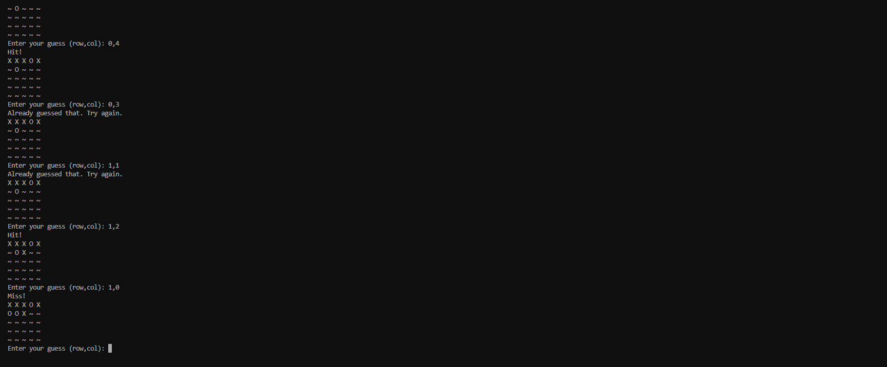

# Battleship Game
[The project ](https://battlehipgame-738b90457e30.herokuapp.com/)
<h2 align="center"></h2>
Battleship Game is a classic and strategic guessing game where you try to sink the computer's ship before it sinks yours. The game involves placing your ship on a grid, making guesses about the location of the computer's ship, and responding to the computer's guesses about your ship.

---

## Table of Contents
1. [How to Play](#how-to-play)
2. [Logic Flowchart](#logic-flowchart)
3. [User Experience (UX)](#user-experience-ux)
    * [User Stories](#user-stories)
4. [Features](#features)
    * [Existing Features](#existing-features)
    * [Features Left to Implement](#features-left-to-implement)
5. [Design](#design)
6. [Technologies Used](#technologies-used)
7. [Frameworks, Libraries & Programs Used](#frameworks-libraries--programs-used)
8. [Testing](#testing)
    * [Manual Testing](#manual-testing)
    * [Input Validation Testing](#input-validation-testing)
    * [Fixed Bugs](#fixed-bugs)
9. [Deployment](#deployment)
    * [Deployment to Heroku](#deployment-to-heroku)
    * [Forking the GitHub Repository](#forking-the-github-repository)
    * [Local Clone](#local-clone)
10. [Credits](#credits)
    * [Code](#code)
    * [Content](#content)
11. [Acknowledgements](#acknowledgements)

---

## How to Play

In this implementation of Battleship, you will play against the computer. The game starts with you placing your ship on a 5x5 grid. After placing your ship, you take turns with the computer to guess the locations of each other's ships. The game ends when one player's ship is completely sunk.

## Logic Flowchart

   - Used Draw.io to make a Flowchart for the game [View](images/flowchart.png)

## User Experience (UX)

Battleship is a strategic guessing game that provides an engaging user experience. The player and computer take turns guessing the location of each other's ships. The objective is to sink the opponent's ship. This game challenges the player's strategic thinking and planning skills while providing an enjoyable gaming experience.

### User Stories

* First-time visitor goals
    * Understand how the game works. Clear instructions on the objective and rules.
    * Enjoy the experience. The Battleship game should be engaging and fun.

* Returning visitor goals
    * Continue playing. The returning visitor may have enjoyed playing the game and wants to play again.
    * Share with friends. Inviting friends to give the game a try.

* Frequent user goals
    * Improving their strategy and accuracy in guessing ship locations.
    * Increasing the difficulty level of the game to challenge themselves.
    * Sharing the game with others or inviting friends to play.

---

## Features

* Ship placement. Player and computer place ships on a grid.
* Guessing mechanics. Take turns guessing the location of the opponent's ship.
* Visual interface. Simple text-based interface to display the game state.
* Hit and miss tracking. Track and display hits and misses on the grid.
* Win or loss detection. Detect when the ship of a player is sunk.
* Play again feature. Ask the player if they want to play again after the game ends.

### Existing Features

* Intro screen
    * Displays a welcome message and prompts to start the game.

* Ship Placement
    * Player places their ship on the grid manually.
    * Computer places its ship randomly.

* Player's Turn
    * Prompt the player to make a guess and check if it's a hit or miss.

* Computer's Turn
    * Computer makes a guess and the result is displayed.

* Game Over
    * Display the result of the game (win or lose) and ask if the player wants to play again.

### Features Left to Implement

* Additional ships and more complex placement rules.
* Different grid sizes and difficulty levels.
* Improved user interface with graphical elements.
* Multiplayer option to play against other human players.

---

---

## Technologies Used

* [Python](https://en.wikipedia.org/wiki/Python_(programming_language))

---

## Frameworks, Libraries & Programs Used

* [Visual Studio](https://code.visualstudio.com/)
    * To write the code.
* [Git](https://git-scm.com/)
    * For version control.
* [GitHub](https://github.com/)
    * Deployment of the code and storing the files online.

## Testing 

The game was manually tested extensively using Codeanywhere terminal.

### Manual Testing

The game was tested through various scenarios to ensure correct functionality. Testing included checking for correct ship placement, valid guesses, and correct hit/miss tracking.

| Feature | Expected Result | Steps Taken | Actual Result |
| ------- | -------------- | ----------- | ------------- |
| Intro Screen   | To display welcome message and prompt to start the game | None | As Expected |
| Ship Placement | To manually place the player's ship and randomly place the computer's ship | Followed prompts for manual placement | As Expected |
| Player's Turn   | Prompt to guess and check if hit or miss | Entered valid coordinates | As Expected |
| Computer's Turn | Computer makes a guess and result displayed | Wait for computer's guess | As Expected |
| Game Over   | Display win or lose message and prompt to play again | Played until game ended | As Expected |

### Input Validation Testing

* Ship placement
    * Ensured ship is placed within grid boundaries.
    * Ensured ship does not overlap with other ships.

* Guess input
    * Ensured guesses are within grid boundaries.
    * Checked for already guessed positions.

## Deployment

### Deploying to Heroku

To deploy with Heroku, follow these steps:
1. Log in to Heroku or create a new account.
2. On the main page click "New" and select "Create new app".
3. Choose your unique app name and select your region.
4. Click "Create app".
5. On the next page find "Settings" and locate "Config Vars".
6. Click "Reveal Config Vars" and add "PORT" key and value "8000", click "Add".
7. Scroll down, locate "Buildpack" and click "Add", select "Python".
8. Repeat step 7. only this time add "Node.js", make sure "Python" is first.
9. Scroll to the top and select "Deploy" tab.
10. Select GitHub as deployment method and search for your repository and link them together.
11. Scroll down and select either "Enable Automatic Deploys" or "Manual Deploy".
12. Deployed site: [Battleship Game](https://battleship-game.herokuapp.com/)

### Forking the GitHub Repository

To fork the repository:
1. Log in to GitHub and locate the [GitHub Repository](https://github.com/yourusername/battleship-game).
2. At the top of the Repository (under the main navigation) locate the "Fork" button.
3. Now you should have a copy of the original repository in your GitHub account.

### Local Clone

To make a local clone:
1. Log in to GitHub and locate the [GitHub Repository](https://github.com/yourusername/battleship-game).
2. Under the repository name click "Clone or download".
3. Click on the code button, select clone with HTTPS, SSH or GitHub CLI and copy the link shown.
4. Open Git Bash.
5. Change the current working directory to the location where you want the cloned directory to be made.
6. Type `git clone` and then paste the URL copied in step 3.
7. Press Enter and your local clone will be created.

## Credits

### Code

* Concepts and logic from Python tutorials and resources.
* Code structure and game flow from personal understanding and game development experience.

### Content

* Battleship game rules and logic.
* All content was written by the developer.

### Acknowledgements

-   My mentor for very helpful feedback.
-   [Python functions](https://www.programiz.com/python-programming/function)
-   [Battleship game exempel in python](http://pythonfiddle.com/battleships-game-in-python/)
-   [Battleship tutorial](https://www.youtube.com/watch?v=tF1WRCrd_HQ&t=317s)
-   [import random in python](https://docs.python.org/3/library/random.html)
-   [Exempeles for import random with simpler tutorial](https://www.toppr.com/guides/python-guide/tutorials/modules/modules/random/use-random-module-to-generate-random-numbers-in-python/)
